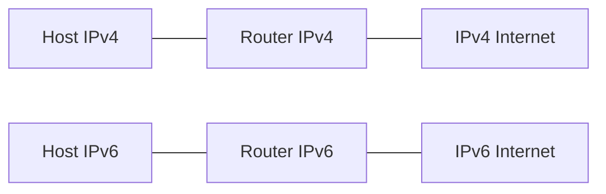

# IPv4 & IPv6

## Einführung
Diese Seite erklärt die Adressierung mit IPv4 und IPv6, Unterschiede, Planung und typische Einsatzszenarien.

## Technische Definition
- IPv4: 32‑Bit Adressen im dezimalen Punktformat (z. B. 192.0.2.1)
- IPv6: 128‑Bit Adressen im hexadezimalen Doppelpunktformat (z. B. 2001:db8::1)

## Detaillierte Erklärung
- IPv4 bietet ~4,3 Milliarden Adressen; verwendet Subnetting und NAT zur Adressökonomie.
- IPv6 bietet riesigen Adressraum, Autokonfiguration (SLAAC), und integrierte Funktionen (z. B. Neighbor Discovery statt ARP).
- Adresstypen: Unicast, Multicast, Anycast (IPv6)

## Wie die Technologie funktioniert
- IPv4: Hosts erhalten Adressen (statisch/DHCP), Routing erfolgt über IPv4‑Routen.
- IPv6: Adressen können per SLAAC, DHCPv6 oder statisch gesetzt werden; Router Advertisement (RA) informieren Hosts.

## OSI‑Layer Relevanz
- Primär Layer 3 (Network)

## Vorteile
- IPv6: kein NAT nötig, größere Adressierung, verbesserte Extension Header
- IPv4: weite Unterstützung, einfacher Betrieb in vielen Netzen

## Nachteile
- IPv4: Adressknappheit, NAT‑Komplexität
- IPv6: Lernkurve, teilweise fehlende Legacy‑Geräteunterstützung

## Sicherheitsüberlegungen
- IPv6 benötigt eigene Firewall‑Regeln; ICMPv6 ist wichtig für Neighbor Discovery — nicht pauschal blockieren
- Dual‑Stack erhöht Angriffsfläche, Absicherung beider Protokolle nötig

## Typische Einsatzfälle
- IPv4: bestehende Netzwerke, Internetzugang mit NAT
- IPv6: neue Netze, Provider‑Netze, Cloud‑Infrastrukturen

## Real‑World Beispiele
- Dual‑Stack‑Bereitstellung für schrittweise Migration
- IPv6‑Only in internen Cloud‑Netzen (bei Providern)

## Häufige Fehler
- Fehlende IPv6 Firewall‑Regeln
- Mismatch von MTU/Path‑MTU im Dual‑Stack
- DNS‑Konfiguration (AAAA Einträge vergessen)

## Troubleshooting‑Hinweise
- Prüfen der IP‑Konfiguration: `ipconfig` / `ip addr`
- Prüfen von RAs und Neighbor Discovery mit `tcpdump`/`ndisc6`
- DNS‑Tests: `dig AAAA example.com` bzw. `dig A`

## Beispiel (IPv6 Adresse setzen Linux)
```bash
ip -6 addr add 2001:db8::10/64 dev eth0
ip -6 route add default via 2001:db8::1
```

## Mermaid‑Diagramm


## Zusammenfassung
IPv4 bleibt relevant, IPv6 ist langfristig die Lösung. Planung (Adresspläne, DNS, Firewall) und Dual‑Stack‑Strategien erleichtern die Migration.

## Verwandte Themen
- [Subnetz](subnetz.md)
- [DHCP](../netzwerkdienste/dhcp.md)
- [DNS](../netzwerkdienste/dns.md)
