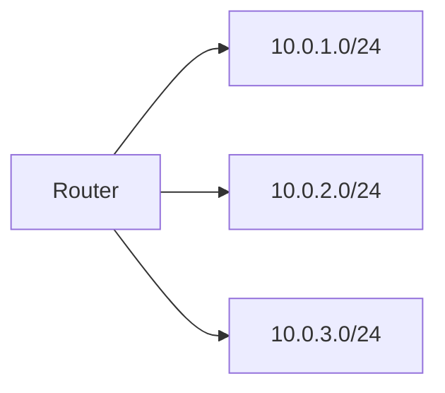

# Subnetz (Subnetting)

## Einführung
Subnetting teilt ein IP‑Netz in kleinere Subnetze, verbessert Sicherheit und Adressverwaltung.

## Technische Definition
Ein Subnetz ist ein IP‑Adressbereich definiert durch eine Adresse und eine Netzmaske (z. B. 192.168.1.0/24). Subnetting verändert die Aufteilung der Bits zwischen Netz‑ und Host‑Teil.

## Detaillierte Erklärung
- Notation: CIDR (z. B. /24, /64)
- Berechnung: Netzadresse, Broadcast, erste/letzte Host‑Adresse
- VLSM ermöglicht flexible Subnetzgrößen

## Wie das funktioniert
- Router trennen Broadcast‑Domänen anhand von Subnetzen; Hosts erkennen, ob Ziel im selben Subnetz liegt und wählen Default Gateway ansonsten.

## OSI‑Layer Relevanz
- Layer 3 (Network)

## Vorteile
- Bessere Adressverwaltung, Isolation von Netzwerkbereichen
- Erleichtert QoS, Sicherheitszonen

## Nachteile
- Komplexität bei großem IP‑Plan
- Fehlerhafte Netmasken führen zu Kommunikationsproblemen

## Sicherheitsüberlegungen
- Subnetting als erste Sicherheitsgrenze (in Kombination mit Firewalls)
- DMZ in eigenem Subnetz

## Typische Einsatzfälle
- Trennung von Management, Server, Gäste, Produktion

## Real‑World Beispiele
- 10.0.0.0/16 aufgeteilt in /24 Subnetze je Abteilung

## Häufige Fehler
- Falsche Netzmaske → Overlap/Reachability Issues
- Keine Dokumentation des IP‑Plans

## Troubleshooting‑Hinweise
- IP‑Plan prüfen, `ip route` auf Routern
- Ping/TCP traceroute zwischen Subnetzen

## Beispiel‑Subnetzberechnung
```text
Netz 192.168.0.0/24 -> 256 Adressen, Hosts 1..254
Subnetze /26 -> 4 Subnetze mit je 64 Adressen (62 Hosts)
```

## Mermaid‑Diagramm


## Zusammenfassung
Subnetting ist essenziell für sauberes IP‑Design. Ein gut dokumentierter IP‑plan vereinfacht Betrieb und Troubleshooting.

## Verwandte Themen
- [IPv4/IPv6](ipv4-ipv6.md)
- [VLAN](vlan.md)
- [DMZ](dmz.md)