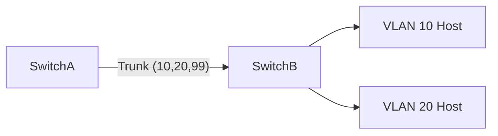

# Trunking (802.1Q Trunks)

## Einführung
Trunking verbindet Switches und transportiert mehrere VLANs über eine einzige physische Verbindung mittels VLAN‑Tagging.

## Technische Definition
Trunk‑Ports verwenden 802.1Q‑Tagging, um VLAN‑IDs in Ethernet‑Frames einzufügen und so mehrere VLANs über einen Link zu transportieren.

## Detaillierte Erklärung
- Trunk vs. Access Port: Access hat ein VLAN, Trunk transportiert viele
- Native VLAN: Frames ohne Tag werden dem Native VLAN zugewiesen
- Allowed VLANs: Liste der VLANs, die über den Trunk zugelassen sind

## Wie es funktioniert
- Switch markiert ausgehende Frames mit VLAN‑Tag; empfangender Switch nutzt Tag zur Zuordnung auf richtigen VLAN‑Port

## OSI‑Layer Relevanz
- Layer 2 (Data Link)

## Vorteile
- Spart Ports, vereinfacht Verkabelung
- Ermöglicht zentrale VLAN‑Verteilung über Backbone

## Nachteile
- Fehlerhafte Native‑VLAN‑Konfiguration kann Sicherheitsrisiko darstellen
- VLAN‑Mismatch kann Netzausfälle verursachen

## Sicherheitsüberlegungen
- Native VLAN untagged vermeiden; setzen Sie Native VLAN auf ein ungenutztes VLAN
- Trunk‑Pruning und Allowed VLANs einschränken

## Typische Einsatzfälle
- Verbindung zwischen Core und Access Switches
- Verbindung von Switch zu Router (Router‑on‑a‑Stick)

## Real‑World Beispiele
- Trunk zwischen Core‑Switch und Distribution‑Switch in Campus‑Netzen

## Häufige Fehler
- Mismatched Trunk Mode (ISL vs dot1q), VLAN nicht erlaubt auf Trunk

## Troubleshooting‑Hinweise
- `show interfaces trunk`, `show vlan` prüfen
- Prüfen auf VLAN‑Mismatch mit `show cdp neighbors` und Interface Settings

## Beispiel (Cisco Trunk Konfiguration)
```text
interface Gig1/0/1
 switchport trunk encapsulation dot1q
 switchport mode trunk
 switchport trunk native vlan 999
 switchport trunk allowed vlan 10,20,99
```

## Mermaid‑Diagramm


## Zusammenfassung
Trunks sind zentral für VLAN‑Verteilung; sichere Native‑VLAN‑Konfiguration und Beschränkung der erlaubten VLANs reduzieren Risiken.

## Verwandte Themen
- [VLAN](vlan.md)
- [Subnetz](subnetz.md)