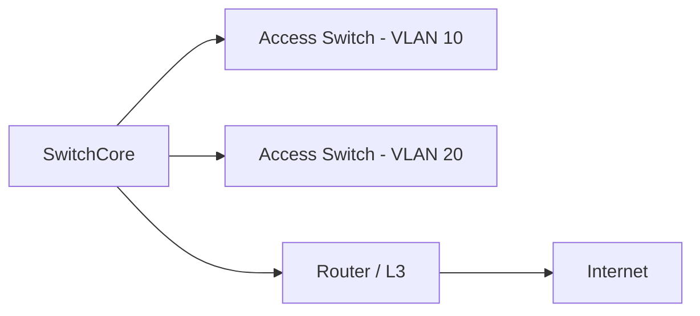

# VLAN (Virtual LAN)

## Einführung
VLANs ermöglichen logische Segmentierung eines physischen Netzwerks zur Trennung von Broadcast‑Domänen.

## Technische Definition
Ein VLAN ist eine virtuelle Broadcast‑Domäne auf Layer 2, realisiert durch Tagging (IEEE 802.1Q) oder portbasierte Zuordnung.

## Detaillierte Erklärung
- Tagging: 802.1Q fügt VLAN‑ID in Ethernet‑Frames ein
- Native VLAN: ungetaggte Frames auf Trunks
- Management‑VLAN, Guest‑VLAN, Voice‑VLAN als typische Beispiele

## Wie es funktioniert
- Access‑Ports sind Mitglied eines VLANs; Trunk‑Ports transportieren getaggte Frames für mehrere VLANs zwischen Switches/Router
- Inter‑VLAN Routing erfolgt auf L3‑Switch oder Router (Router‑on‑a‑Stick / SVI)

## OSI‑Layer Relevanz
- Layer 2 (VLAN Tagging) und Layer 3 (Inter‑VLAN Routing)

## Vorteile
- Sicherheits‑ und Performance‑Isolation
- Einfaches Segmentieren nach Funktion/Team

## Nachteile
- Fehlkonfiguration (VLAN‑Hopping) kann Sicherheitslücken öffnen
- Komplexität in großen Netzen

## Sicherheitsüberlegungen
- Native VLAN vermeiden oder absichern
- Private VLANs, PVLAN, und ACLs für zusätzliche Sicherheit
- Trunk‑Sicherheit (allowed VLANs, pruning)

## Typische Einsatzfälle
- Trennung von Management, Benutzer, Gäste, VoIP

## Real‑World Beispiele
- Voice VLAN für IP‑Telefonie mit QoS Tagging

## Häufige Fehler
- VLAN‑Mismatch auf Trunks
- Unzureichende Trunk Security (tagged native frames)

## Troubleshooting‑Hinweise
- `show vlan brief`, `show interfaces trunk`, `show ip route` prüfen
- Ping zwischen SVI/Router Interfaces testen

## Beispiel (Cisco SVI)
```text
interface Vlan10
 ip address 10.10.10.1 255.255.255.0
!
interface Gig0/1
 switchport trunk encapsulation dot1q
 switchport mode trunk
 switchport trunk allowed vlan 10,20,99
```

## Mermaid‑Diagramm


## Zusammenfassung
VLANs sind mächtige Werkzeuge zur Segmentierung — saubere Trunk‑Konfiguration und Dokumentation sind Pflicht.

## Verwandte Themen
- [Trunking](trunking.md)
- [Subnetz](subnetz.md)