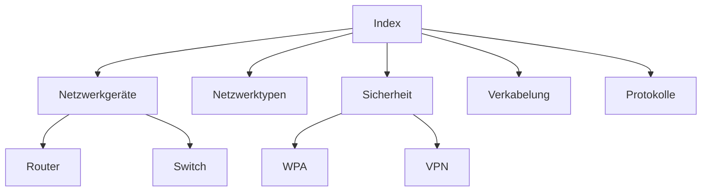

# Wiki Netzwerktechnik — Übersicht

## Schnellstart
- Suche oben rechts benutzen (Material Theme) oder das Inhaltsverzeichnis unten.
- Empfohlene Startseiten: [Netzwerkgeräte](netzwerkgeraete/router.md), [Adressierung](adressierung/ipv4-ipv6.md), [Sicherheit](sicherheit/wpa.md)
- Für praktische Übungen: [Verkabelung → Cat‑Kabel](verkabelung/cat-kabel.md) und [PoE](uebertragung/poe.md)

## Struktur (Auswahl)
| Bereich | Kurzbeschreibung |
|---|---|
| Netzwerkgeräte | Router, Switches, Firewall, NAS — Grundlagen und Beispiele |
| Netzwerktypen | LAN, WAN, WLAN, Mesh — Topologien und Einsatzszenarien |
| Sicherheit | WPA, VPN, SSH, Verschlüsselung, Best Practices |
| Verkabelung | Cat‑Kabel, RJ45, EIA‑568, Patchkabel |
| Protokolle & Dienste | TCP/UDP, DHCP, DNS, HTTP, FTP |

## Schnelle Links
- Netzwerkgeräte: [Router](netzwerkgeraete/router.md) • [Switch](netzwerkgeraete/switch.md) • [Firewall](netzwerkgeraete/firewall.md)
- Adressierung: [IPv4/IPv6](adressierung/ipv4-ipv6.md) • [Subnetz](adressierung/subnetz.md) • [VLAN](adressierung/vlan.md)
- Dienste: [DHCP](netzwerkdienste/dhcp.md) • [DNS](netzwerkdienste/dns.md)

## Site‑Map (vereinfachte Übersicht)

---