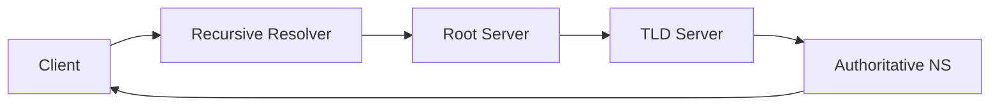

# DNS (Domain Name System)

## Einführung
DNS übersetzt menschenlesbare Domainnamen in IP‑Adressen und ist ein kritischer Dienst im Internet und lokalen Netzwerken.

## Technische Definition
DNS ist ein hierarchisches, verteiltes Namensauflösungssystem, das auf UDP/TCP (Port 53) arbeitet. Zonen, Nameserver (Authoritative, Recursive) und Records (A, AAAA, CNAME, MX, PTR) sind Kernkonzepte.

## Detaillierte Erklärung
- Zonen: administrative Bereiche (z. B. example.com)
- Record‑Typen: A/AAAA (Adresse), MX (Mail), CNAME (Alias), TXT, SRV, PTR (Reverse)
- Rekursive Resolver vs. Authoritative Nameserver

## Wie es funktioniert
- Client/Resolver fragt rekursiven Resolver → dieser fragt Root → TLD → Authoritative Server → Antwort gecached zurück
- Caching reduziert Latenz, TTL steuert Dauer

## OSI‑Layer Relevanz
- Layer 7 (Application) über UDP/TCP

## Vorteile
- Menschenfreundliche Namen, skalierbare Verteilung

## Nachteile
- Komplexität bei Zonenverwaltung, Abhängigkeiten durch TTL/Caching

## Sicherheitsüberlegungen
- DNS‑SEC zur Absicherung der Integrität
- Split‑DNS für interne/externe Namensräume
- Schutz vor Cache Poisoning, DDoS‑Angriffen (Anycast)

## Typische Einsatzfälle
- Namensauflösung für interne Dienste, Mailrouting, Service Discovery (SRV)

## Real‑World Beispiele
- Interne DNS‑Zone mit Active Directory, öffentliche DNS mittels Cloud‑Provider Anycast

## Häufige Fehler
- Falsche TTL‑Werte, inkonsistente Zonen, fehlende Reverse‑Einträge für Mailserver

## Troubleshooting‑Hinweise
- `dig`/`nslookup` für Tests
- Prüfen von Zonendateien, Serial‑Nummern, Firewall‑Regeln

## Beispiel (dig)
```bash
dig @8.8.8.8 example.com A
```

## Mermaid‑Diagramm


## Zusammenfassung
DNS ist kritisch für nahezu alle Netzwerkdienste. DNS‑SEC, Monitoring und saubere Zonenverwaltung sind essenziell.

## Verwandte Themen
- [DHCP](dhcp.md)
- [DNS‑SEC / Sicherheit](../sicherheit/aes.md)

