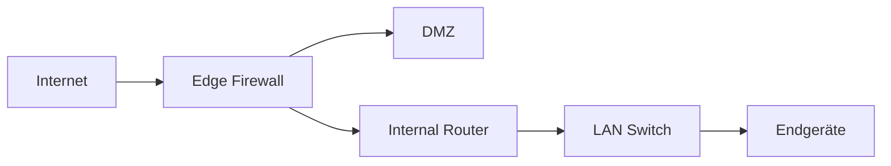

# Firewall

## Einführung
Firewalls kontrollieren Netzwerkverkehr anhand definierter Regeln und schützen Netzwerke vor unerwünschten Zugriffen. Sie können auf verschiedenen Ebenen (Packet, Connection, Application) arbeiten.

## Technische Definition
Eine Firewall ist eine Netzwerk‑Sicherheitskomponente, die Pakete/Verbindungen analysiert und anhand von Regeln erlaubt oder blockiert; Typen umfassen stateless, stateful und Next‑Gen Firewalls.

## Detaillierte Erklärung
- Stateless Packet Filter: Regelbasiert ohne Verbindungszustand
- Stateful Inspection: Verfolgt Verbindungen und trifft Entscheidungen basierend auf Zustandsinformationen
- NGFW: Anwendungserkennung, TLS‑Inspection, IPS
- Platzierung: Edge (Internet↔LAN), Zwischen Zonen (DMZ, Produktionsnetz)

## Wie die Technologie funktioniert
- Packets werden an der Schnittstelle empfangen → Regeln (ACLs) geprüft → Entscheidung (allow/deny) → ggf. State‑Table aktualisiert → Logging.
- Bei NGFW zusätzlich Deep Packet Inspection und Signaturabgleich.

## OSI‑Layer Relevanz
- Layer 3/4: Packet/Connection‑Filtering
- Layer 7: Application‑Layer Inspection (NGFW)

## Vorteile
- Kontrolle über ein‑/ausgehenden Traffic
- Schutz vor Port‑Scans, unerlaubtem Zugriff
- Möglichkeit zur Protokoll‑ und Anwendungskontrolle (NGFW)

## Nachteile
- Komplexe Regelwerke sind fehleranfällig
- Performance‑Kosten bei Deep Inspection
- Verschlüsselte Verbindungen erschweren Inspection

## Sicherheitsüberlegungen
- Prinzip der geringsten Rechte: nur notwendige Ports öffnen
- Logging & Monitoring (SIEM, Syslog)
- Regeltestumgebung vor Produktivänderungen
- TLS‑Inspection mit Vorsicht (Privacy/Legal)

## Typische Einsatzfälle
- Edge‑Firewall am Internetzugang
- DMZ‑Firewall für öffentlich zugängliche Dienste
- Mikrosegmentierung innerhalb des Rechenzentrums

## Real‑World Beispiele
- Kleine Firma: UTM‑Appliance (Firewall, VPN, Antivirus)
- Großunternehmen: NGFW + separate IPS/IDS Systeme

## Häufige Fehler
- Zu offene Regeln (0.0.0.0/0 ohne Beschränkung)
- Fehlende Dokumentation der Regelwerke
- Ungepatchte Firewall‑Software

## Troubleshooting‑Hinweise
- Regelhits/Logs prüfen (welche Regel hat blockiert?)
- State‑Table prüfen (volle NAT/State‑Tables blockieren neue Verbindungen)
- Verbindung testen mit `telnet`/`nc` auf Port

## Beispiel‑ACL (pseudocode)
```text
allow tcp from 192.168.1.0/24 to 203.0.113.10 port 443
deny ip from any to 10.0.0.0/8
```

## Mermaid‑Diagramm


## Zusammenfassung
Firewalls sind unverzichtbar für Netzwerksicherheit. Sorgfältige Planung, Dokumentation und Monitoring sind notwendig, um Sicherheit und Verfügbarkeit zu gewährleisten.

## Verwandte Themen
- [Router](router.md)
- [DMZ](../adressierung/dmz.md)
- [VPN](../sicherheit/vpn.md)