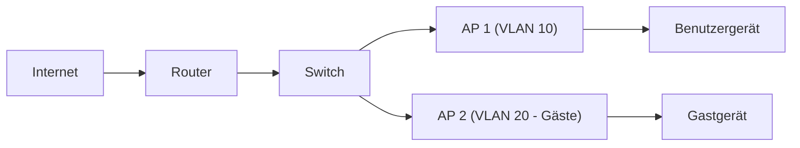

# Hotspot / Access Point (AP)

Zielgruppe: IT‑Auszubildende, Fachinformatiker Systemintegration und Einsteiger-Administratoren

## Einführung
Ein Hotspot bzw. Access Point stellt kabellosen Netzwerkzugang (WLAN) bereit. In Unternehmen werden APs zentral verwaltet; in kleinen Netzwerken meist als einzelne Geräte betrieben.

## Technische Definition
Ein Access Point verbindet drahtlose Clients mit einem kabelgebundenen LAN und stellt SSIDs, Authentifizierung und Verschlüsselung bereit. Funktional oft auf Layer 2, Management auf höheren Ebenen.

## Detaillierte Erklärung
- SSID & BSSID: Netzwerkname und MAC‑Adresse des Radios
- Authentifizierung: WPA2/WPA3 (Enterprise vs. Personal)
- Frequenzen: 2,4 GHz, 5 GHz, 6 GHz (abhängig vom Standard)
- Captive Portal: Webbasierte Zugangskontrolle für Gäste

## Wie die Technologie funktioniert
- Client verbindet sich über SSID → AP leitet Traffic ins VLAN des Switches → Router/Firewall übernimmt Routing/NAT.
- APs können als Standalone oder Controller‑basiert (zentrale Verwaltung) betrieben werden.

## OSI‑Layer Relevanz
- Primär Layer 2 (Data Link)
- Funk (PHY) und Management (Layer 7) sind ebenfalls relevant

## Vorteile
- Mobility für Endgeräte
- Einfache Skalierung durch zusätzliche APs
- Guest‑Netze und VLAN‑Trennung möglich

## Nachteile
- Begrenzte Funkreichweite und Störanfälligkeit
- Bandbreiten‑Teilung bei vielen Clients

## Sicherheitsüberlegungen
- Nutzung von WPA3‑Enterprise wenn möglich
- Separation von Gastnetz (VLAN + Firewall)
- Deaktivierung unsicherer Funktionen (WPS)
- Kanalplanung und Sendeleistung anpassen

## Typische Einsatzfälle
- Öffentliche Hotspots mit Captive Portal
- Unternehmens‑WLAN mit Roaming und zentralem Controller
- Heimnetz mit 1–2 APs für Abdeckung

## Real‑World Beispiele
- Uni‑Campus: Hunderte APs mit zentraler Authentifizierung per RADIUS
- Café: Einzelner AP mit Captive Portal und Gäste‑VLAN

## Häufige Fehler
- Falsche Kanalwahl → Überlappungen
- Keine VLAN‑Trennung für Gäste
- Unsichere Verschlüsselung (WEP/TKIP)

## Troubleshooting‑Hinweise
- Sichtprüfung: SSID sichtbar? Signalstärke (RSSI) messen
- Kanalkonflikte prüfen (WLAN‑Analysetool)
- Client‑Authentifizierungslogs am AP/Controller prüfen

## Beispiel‑Konfiguration (WPA2 Personal)
```text
SSID "Betrieb" {
  security wpa2-psk
  passphrase "sicheresPasswort"
}
```

## Mermaid‑Diagramm


## Zusammenfassung
APs ermöglichen flexiblen Zugang, benötigen aber sorgfältige Planung (Frequenz, Sicherheit, VLANs), um Leistung und Sicherheit zu gewährleisten.

## Verwandte Themen
- [WLAN Frequenzen & Standards](../wlan/wifi-standards.md)
- [VLAN](../adressierung/vlan.md)
- [RADIUS / WLAN‑Authentifizierung](../netzwerkdienste/radius.md)
