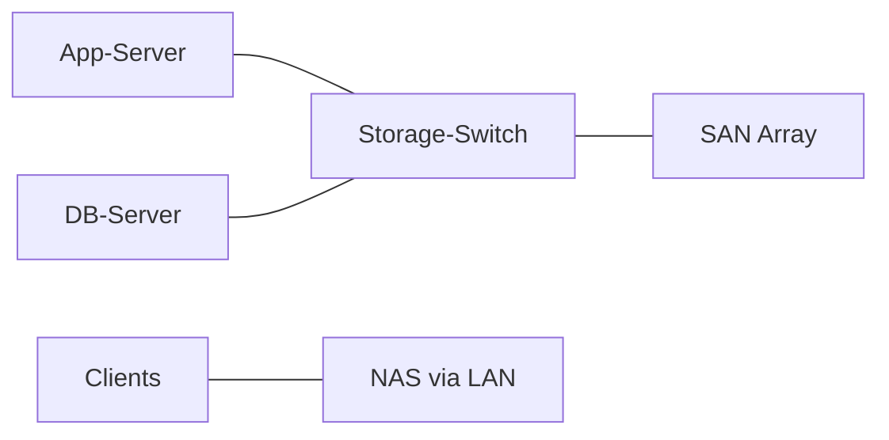

# NAS & SAN — Netzwerkbasierte Storage‑Lösungen

## Einführung
NAS (Network Attached Storage) und SAN (Storage Area Network) sind zwei Konzepte zur Bereitstellung von Speicherressourcen im Netzwerk. NAS liefert Datei‑Level‑Zugriff; SAN bietet Block‑Level‑Zugriff.

## Technische Definition
- NAS: Dateibasiertes Speichersystem, bedient Protokolle wie SMB/CIFS und NFS.
- SAN: Blockbasiertes Speichersystem, verwendet iSCSI oder Fibre Channel für Blockzugriff.

## Detaillierte Erklärung
- NAS:
  - Verwaltet Dateisysteme und Benutzerzugriffe
  - Einfach zu betreiben, ideal für Dateifreigaben und Backups
- SAN:
  - Präsentiert rohe Block‑Volumes an Serversysteme
  - Besser für Datenbanken, Virtualisierung, hohe I/O‑Anforderungen

## Wie die Technologien funktionieren
- NAS: Clients greifen über SMB/NFS auf freigegebene Verzeichnisse zu; NAS verwaltet Berechtigungen.
- SAN: Server verbinden sich per iSCSI/FC zu einem LUN; Betriebssystem nutzt das Volume wie eine lokale Festplatte.

## OSI‑Layer Relevanz
- NAS: Layer 4/7 (SMB/NFS über TCP/IP)
- SAN: Layer 2/3 (iSCSI über IP) oder Layer 2 (Fibre Channel über FC‑Switches)

## Vorteile
| Typ | Vorteile |
|---|---|
| NAS | Einfache Verwaltung, Benutzerfreundlich, gut für File‑Sharing |
| SAN | Hohe Performance, niedrige Latenz, geeignet für Datenbanken/VMs |

## Nachteile
| Typ | Nachteile |
|---|---|
| NAS | Skalierungslimits, Performance‑Grenzen bei vielen Clients |
| SAN | Komplexität, Kosten (Fibre Channel), spezialisiertes Management |

## Sicherheitsüberlegungen
- Zugriffskontrolle, ACLs, SMB‑Signing, NFS‑Export‑Beschränkungen
- Verschlüsselung ruhender Daten (at‑rest) und im Transit
- Netzwerk‑Segregation: Storage‑VLAN oder dediziertes Storage‑Netz

## Typische Einsatzfälle
- NAS: Home/SMB File‑Shares, Backup‑Server, Medien‑Server
- SAN: Enterprise‑Virtualisierung (VMware), Datenbank‑Cluster, HPC

## Real‑World Beispiele
- NAS: Synology/QNAP für File‑Sharing und Backup
- SAN: iSCSI‑Storage für VMware Datastores oder Fibre Channel SAN in Rechenzentren

## Häufige Fehler
- Falsche LUN‑Zuweisungen, unsaubere Multipathing‑Konfiguration
- Fehlende Netzwerk‑Isolation für Storage‑Traffic

## Troubleshooting‑Hinweise
- Verbindungsstatus prüfen (`iscsiadm` / SAN‑Management)
- Latenz & IOPS messen, Storage‑Switch Logs prüfen
- SMB/NFS Berechtigungen und Mount‑Optionen kontrollieren

## Beispiel (iSCSI Discovery)
```bash
# Auf Linux: iSCSI Target entdecken und verbinden
iscsiadm -m discovery -t sendtargets -p 10.0.0.10
iscsiadm -m node -T iqn.example:target -p 10.0.0.10 -l
```

## Mermaid‑Diagramm


## Zusammenfassung
NAS und SAN erfüllen unterschiedliche Anforderungen: NAS ist benutzerfreundlich für Dateizugriff; SAN bietet Block‑Level‑Performance für anspruchsvolle Workloads. Auswahl hängt von Performance‑, Skalierungs‑ und Budgetanforderungen ab.

## Verwandte Themen
- [NAS Grundlagen](../netzwerkdienste/dhcp.md)
- [iSCSI / Fibre Channel](../uebertragung/dsl.md)
