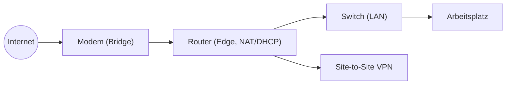

# Router

## Einführung
Router verbinden unterschiedliche IP‑Netze (z. B. LAN ↔ WAN) und leiten IP‑Pakete zwischen ihnen weiter. Sie sind das Herzstück der Netzwerkinfrastruktur.

## Technische Definition
Ein Router ist ein Netzwerkgerät, das auf der IP‑Schicht (OSI Layer 3) arbeitet und anhand von Routing‑Tabellen entscheidet, wohin Pakete gesendet werden.

## Detaillierte Erklärung
- LAN vs. WAN:
  - LAN: Lokales Netzwerk innerhalb eines Standorts.
  - WAN: Weitverkehrsnetz, z. B. Internet oder Verbindungen zwischen Standorten.
- Default Gateway: Adresse des Routers im LAN, an die Hosts Traffic für andere Netze senden.
- Routing‑Tabellen und Protokolle: Statische Routen, OSPF, BGP, RIP.
- NAT: Übersetzung privater IPs zu öffentlichen IPs (Source NAT, Port‑NAT).
- DHCP: Router können als DHCP‑Server oder Relay fungieren (IP‑Vergabe, Gateway, DNS).

## Wie die Technologie funktioniert
- Paketfluss: Eingehende Pakete werden anhand Ziel‑IP mit der Routing‑Tabelle verglichen; die beste Route wird gewählt.
- Forwarding: Hardware‑ (ASIC) oder softwarebasiertes Forwarding beeinflusst Performance.
- NAT‑Verarbeitung: Quell‑IP/TCP‑Port werden ersetzt und Mapping in einer NAT‑Tabelle gehalten.

## Relevanz im OSI‑Modell
- Primär: Layer 3 (Network)
- Sekundär: Layer 2 (wenn Switch‑Funktionen integriert), Layer 4 (bei ACLs/Firewall‑Funktionalität)

## Vorteile
- Trennung und Verbindung unterschiedlicher Netze
- Unterstützung für Routingprotokolle und Policies
- Integration von Diensten (NAT, DHCP, VPN)

## Nachteile
- Komplexität (Routing, ACLs, VPN)
- Performance‑Limitierungen bei günstigen Geräten
- Fehlkonfigurationen haben große Auswirkung

## Sicherheitsaspekte
- Managementzugriff: Nur SSH/HTTPS, starke Passwörter, IP‑Restriktion
- Dienste minimieren: UPnP/WPS/Unnötige Management‑Dienste deaktivieren
- Firewall/ACLs ergänzen NAT
- Regelmäßige Firmware‑Updates und Monitoring

## Typische Anwendungsfälle
- Heimrouter mit NAT und DHCP
- Edge‑Router am Internet‑Übergang einer Firma
- Site‑to‑Site VPN wie IPsec oder TLS VPN

## Real‑World Beispiel
- Heimnetz: Modem (Bridge) → Router (DHCP+NAT, WLAN) → Switch → Clients
- Firma: Internet → Edge‑Router → Firewall → Core‑Router → Switch‑Fabric

## Häufige Fehler
- Doppeltes NAT durch ISP‑Gateway + Router
- Fehlender Default Route (Kein Internetzugang)
- Unzureichende ACLs (zu offen oder zu restriktiv)

## Troubleshooting‑Hinweise
- Prüfen der Routing‑Tabelle: `show ip route` (CLI)
- Default Gateway testen: `ping <gateway>` von Host
- NAT‑Mappings prüfen (bei Routern mit CLI)
- Logs und Schnittstellenstatistiken analysieren (`show interfaces`)

## Beispiel‑Konfiguration (statisch)
```text
interface Gig0/0
  ip address 192.0.2.1 255.255.255.0
ip route 0.0.0.0 0.0.0.0 198.51.100.1
```

## Mermaid‑Diagramm


## Zusammenfassung
Router sind essenziell zum Verbinden von Netzen. Verständnis von Routing, NAT, Default Gateway und DHCP ist grundlegend für Planung und Troubleshooting.

## Verwandte Themen
- [Switch](switch.md)
- [Firewall](firewall.md)
- [DHCP](../netzwerkdienste/dhcp.md)
- [NAT & Subnetze](../adressierung/subnetz.md)
