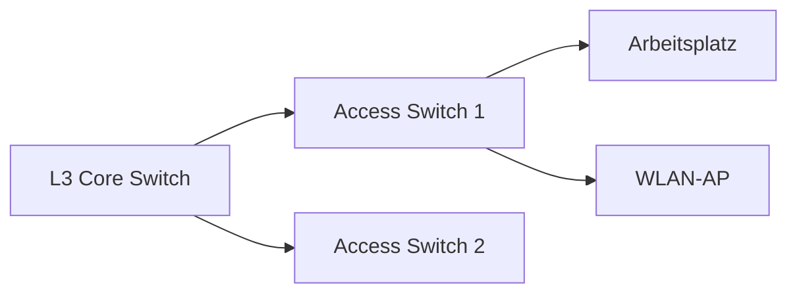

# Switch

## Einführung
Switches verbinden Geräte innerhalb eines LANs und leiten Ethernet‑Frames basierend auf MAC‑Adressen weiter. Sie bilden das Rückgrat lokaler Netzwerke.

## Technische Definition
Ein Switch ist ein Layer‑2‑Gerät (OSI) zur Weiterleitung von Ethernet‑Frames; Managed‑Switches bieten zusätzliche Layer‑3‑Funktionen.

## Detaillierte Erklärung
- MAC‑Address Table: Lernt Port‑zu‑MAC‑Zuordnungen und leitet Frames zielgerichtet weiter.
- Switching‑Methoden: Store‑and‑forward, Cut‑through.
- VLANs (802.1Q): Logische Segmentierung zur Trennung von Broadcast‑Domänen.
- Trunking: VLAN‑Tagging zwischen Switches/Routern.
- Layer‑3 Switches: Unterstützen Inter‑VLAN‑Routing und ACLs.

## Wie die Technologie funktioniert
- Ein Frame ankommt → Source MAC wird gelernt → Ziel‑MAC wird in Tabelle gesucht → Frame auf Zielport gesendet oder geflutet (bei unbekannter MAC).
- Broadcasts werden an alle Ports im selben VLAN verteilt.

## OSI‑Layer Relevanz
- Primär: Layer 2 (Data Link)
- Sekundär: Layer 3 (bei L3‑Switches)

## Vorteile
- Effiziente lokale Weiterleitung (geringe Latenz)
- Unterstützung für VLANs, QoS, Port‑Mirroring

## Nachteile
- Unmanaged Switches bieten keine Sicherheit/Segmentation
- Komplexität bei großen VLAN‑Designs

## Sicherheitsüberlegungen
- Port Security (MAC‑Binding)
- Spanning Tree Einstellungen (BPDU Guard)
- Management‑Zugriff absichern (SNMPv3, SSH, Management‑VLAN)

## Typische Einsatzfälle
- Access‑Layer: Verbindung von Endgeräten
- Distribution/Core: Aggregation von Access‑Switches
- VLAN‑Segmentierung für DMZ, Management, Gäste

## Real‑World Beispiele
- Büro: Access‑Switches verbinden Arbeitsplätze; VLANs trennen VoIP und Benutzer.
- Rechenzentrum: L3‑Core‑Switches routen zwischen Subnetzen.

## Häufige Fehler
- VLAN‑Mismatch an Trunks
- Port als Access statt Trunk konfiguriert
- Spanning Tree Loops durch falsche Konfiguration

## Troubleshooting‑Hinweise
- MAC‑Tabellen prüfen: `show mac address-table`
- Port‑Status: `show interfaces status`
- VLAN‑Zuweisung prüfen: `show vlan brief`

## Beispiel‑Konfiguration (802.1Q Trunk)
```text
interface Gig1/0/1
  switchport trunk encapsulation dot1q
  switchport mode trunk
  switchport trunk allowed vlan 10,20,99
```

## Mermaid‑Diagramm


## Zusammenfassung
Switches sind zentrale Komponenten im LAN. Richtige VLAN‑ und Trunk‑Konfiguration sowie Sicherheitsmaßnahmen verhindern Betriebsstörungen und verbessern Performance.

## Verwandte Themen
- [Router](router.md)
- [VLAN](../adressierung/vlan.md)
- [Trunking](../adressierung/trunking.md)