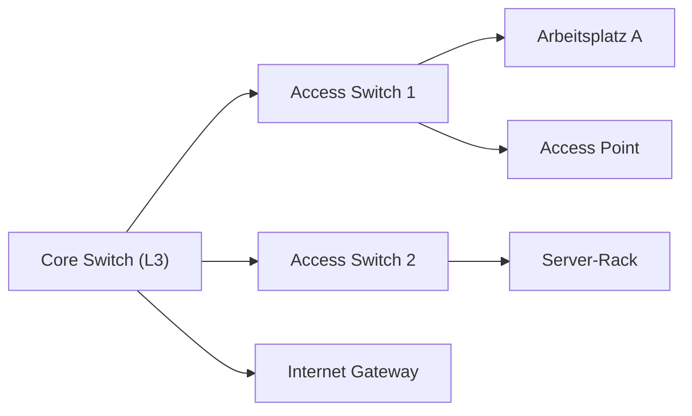

# LAN (Local Area Network)

Zielgruppe: IT‑Auszubildende, Fachinformatiker Systemintegration, Einsteiger‑Administratoren

## Einführung
Ein LAN (Local Area Network) verbindet Geräte in einem begrenzten geografischen Bereich (z. B. Büro, Gebäude). Fokus: schnelle Übertragung, geringe Latenz und gemeinsame Nutzung von Ressourcen.

## Technische Definition
Ein LAN nutzt Ethernet (kabelgebunden) und/oder WLAN (kabellos) und operiert primär auf OSI‑Layer 1 (Physical) und Layer 2 (Data Link); Routing zwischen Subnetzen findet auf Layer 3 statt.

## Detaillierte Erklärung
- Topologien: Stern (heute Standard), Ring (historisch), vermascht für Redundanz.
- Komponenten: Switches (Access/Core), Router, Access Points, Server, NAS, Verkabelung (CATx, Glasfaser).
- Adressierung: MAC‑Adressen (Layer 2), IPv4/IPv6 (Layer 3).

## Wie das LAN funktioniert
- Switches leiten Frames anhand der MAC‑Address‑Table zielgerichtet weiter.
- Broadcasts/ARP werden im selben VLAN verteilt.
- Kommunikation zwischen Subnetzen erfolgt über einen Router (Default Gateway).

## OSI‑Layer Relevanz
- Layer 1: Verkabelung, Funk
- Layer 2: Switching, VLANs, MAC‑Adresse
- Layer 3: Routing zwischen Subnetzen (Default Gateway)

## Vorteile
- Hohe Bandbreiten (1G/10G/40G etc.), niedrige Latenz
- Zentralisierte Ressourcen (Dateiserver, Drucker)

## Nachteile
- Begrenzte Reichweite (Standortgebunden)
- Fehlerhafte Konfiguration kann Broadcast‑Stürme oder Sicherheitslücken verursachen

## Sicherheitsüberlegungen
- VLAN‑Segmentierung (Trennung Management, Mitarbeiter, Gäste)
- Port‑Security, 802.1X für Authentifizierung
- Monitoring (NetFlow, SNMPv3) und Logging

## Typische Anwendungsfälle
- Unternehmensbüros, Schulen, Produktionslinien, Rechenzentren (als LAN‑Segmente)

## Real‑World Beispiele
- Büro mit Core/Distribution/Access‑Layer: Core‑Switch (L3) verbindet mehrere Access‑Switches; VLANs trennen Abteilungen.

## Häufige Fehler
- VLAN‑Mismatch an Trunks
- Unzureichende Spanning‑Tree Konfiguration → Loops
- Management‑Ports ungesichert

## Troubleshooting‑Hinweise
- Physisch prüfen: Kabel, SFP‑Module, LEDs
- Switch‑Kommandos: `show mac address-table`, `show interfaces status`, `show spanning-tree`
- Netzwerktests: `ping`, `traceroute`, ARP‑Tabelle prüfen

## Beispiel‑IP‑Plan (kleines Büro)
```text
Netz 10.10.10.0/24
  Management VLAN 99: 10.10.99.0/24
  Mitarbeiter VLAN 10: 10.10.10.0/24
  Gast VLAN 20: 10.10.20.0/24
Router (Gateway): 10.10.10.1
```

## Mermaid‑Diagramm


## Zusammenfassung
LANs sind das grundsätzliche Konstrukt für lokale Netzwerke. Sauberes VLAN‑Design, redundante Verkabelung und abgesicherte Management‑Schnittstellen erhöhen Stabilität und Sicherheit.

## Verwandte Themen
- [WLAN](wlan.md)
- [Switch](../netzwerkgeraete/switch.md)
- [Router](../netzwerkgeraete/router.md)
- [VLAN](../adressierung/vlan.md)
