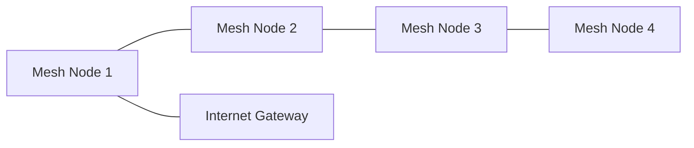

# Mesh‑Netzwerke

Zielgruppe: IT‑Auszubildende, Fachinformatiker Systemintegration, Einsteiger‑Administratoren

## Einführung
Mesh‑Netzwerke verbinden mehrere Knoten zu einem selbstheilenden, dynamischen Netz. Sie erweitern Abdeckung und Redundanz, besonders dort, wo Kabel‑Backhaul eingeschränkt ist.

## Technische Definition
Ein Mesh ist ein vermaschtes Netzwerk, bei dem Knoten (APs/Router/Sensoren) untereinander Routen aufbauen und Daten ggf. über mehrere Hops weiterleiten; Implementierungen reichen von Layer‑2‑Bridging bis Layer‑3‑Routing.

## Detaillierte Erklärung
- Topologie: Multi‑Path Verbindungen zwischen Knoten; kein einzelner Ausfallpunkt.
- Routing‑Protokolle: BATMAN, OLSR, 802.11s (WLAN‑Mesh), proprietäre Lösungen.
- Backhaul: Drahtlos (dediziertes Band) oder kabelgebunden (empfohlen für Performance).

## Wie es funktioniert
- Knoten entdecken Nachbarn → erstellen Routing‑Tabellen → senden Daten über beste verfügbare Pfade. Bei Ausfall eines Knotens werden Wege neu berechnet.

## OSI‑Layer Relevanz
- Layer 2: Mesh als Bridge (802.11s)
- Layer 3: Mesh‑Routing (BATMAN) für IP‑Weiterleitung

## Vorteile
- Erweiterte Abdeckung ohne Kabel
- Selbstheilend, resilient gegen Knotenausfälle

## Nachteile
- Performance‑Verlust bei vielen Hops (Overhead)
- Komplexität bei Interoperabilität verschiedener Hersteller

## Sicherheitsüberlegungen
- Verschlüsselung der Backhaul‑Verbindungen
- Authentifizierung und Vertrauen zwischen Knoten
- Management‑Zugang schützen; Firmware aktuell halten

## Typische Einsatzfälle
- Ländliche Netzausdehnung, Community‑Netze, Event‑Netzwerke, IoT‑Sensorennetze

## Real‑World Beispiele
- Freifunk Community Mesh
- Enterprise‑Deployment mit kabelgebundenem Backbone für kritische Bereiche

## Häufige Fehler
- Drahtloser Backhaul über zu viele Hops ohne gebündelten Kanal
- Fehlende Kanalplanung → Interferenz und niedrige Durchsätze

## Troubleshooting‑Hinweise
- Hop‑Count & Routen prüfen (`batctl o` für BATMAN)
- Signal‑Qualität (RSSI) zwischen Knoten messen
- Firmware‑Versionen und Kompatibilität sicherstellen

## Mermaid‑Diagramm

## Zusammenfassung
Mesh‑Netzwerke bieten flexible Erweiterung und Resilienz, benötigen aber sorgfältige Planung für Backhaul und Kanalverwaltung, um Performance einzuhalten.

## Verwandte Themen
- [WLAN](wlan.md)
- [Hotspot / Access Point](../netzwerkgeraete/hotspot.md)
