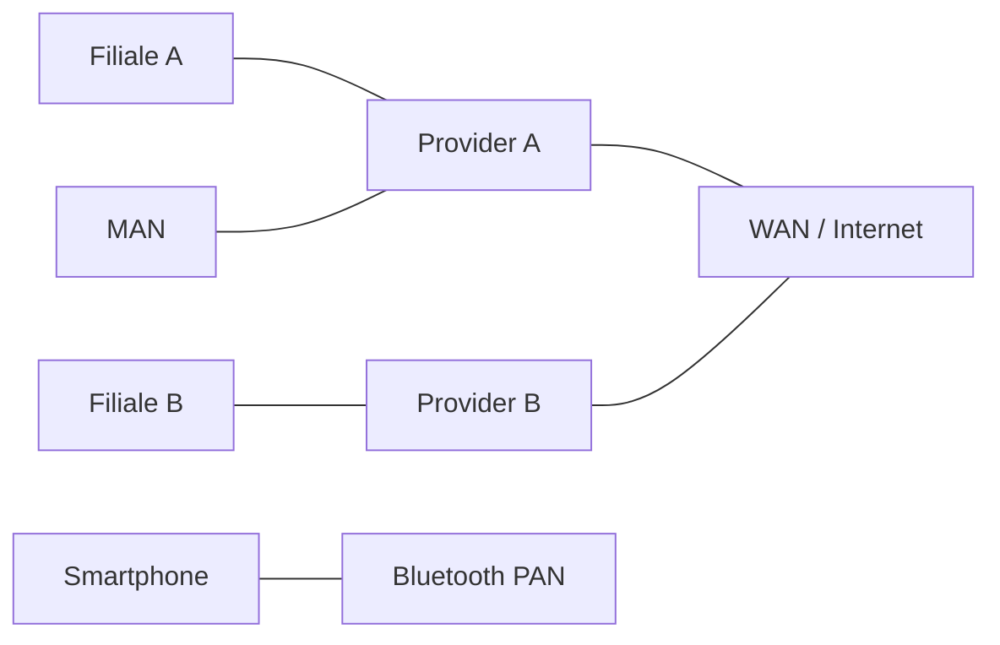

# WAN, PAN, GAN, MAN — Netzwerktypen im Überblick

Zielgruppe: IT‑Auszubildende, Fachinformatiker Systemintegration, Einsteiger‑Administratoren

## Einführung
Netzwerktypen unterscheiden sich nach Reichweite, Topologie und Zweck. Dieses Dokument fasst PAN (Personal), LAN (Local), MAN (Metropolitan), WAN (Wide) und GAN (Global) zusammen und zeigt typische Technologien und Einsatzzwecke.

## Technische Definitionen
- PAN (Personal Area Network): Sehr kleines Netzwerk um eine Person (z. B. Bluetooth, USB‑Tethering).
- LAN: siehe [LAN](lan.md).
- MAN (Metropolitan Area Network): Netz über eine Stadt/Region (z. B. Metro‑Ethernet).
- WAN (Wide Area Network): Verbindung über große geographische Distanzen; oft Provider‑gestützt (MPLS, Internet).
- GAN (Global Area Network): Globales Netzwerkverbund; das Internet ist das prominenteste Beispiel.

## Detaillierte Erklärung
- Technologien und Protokolle:
  - PAN: Bluetooth, ZigBee, NFC — Layer 1/2 Technologien für kurze Reichweiten.
  - MAN: Metro‑Ethernet, Glasfaser‑Ringe — oft Provider‑bereitgestellt.
  - WAN: MPLS, Internet‑VPN (IPsec, SSL/TLS), Carrier‑Backbones; BGP für Routing zwischen Providern.

## Wie die Technologien funktionieren
- PAN nutzt direkte Funk/USB‑Verbindungen zwischen Endgeräten.
- MAN setzt auf lokale Glasfaser/Metro‑Ethernet‑Infrastruktur zur Verbindung von Gebäuden/Stadtteilen.
- WAN verwendet Routing über Provider‑Netze; Overlay‑Techniken (VPN) verschlüsseln Daten über öffentliche Netze.

## OSI‑Layer Relevanz
- PAN: Layer 1/2 (PHY, Data Link)
- MAN: Layer 2/2.5 (Metro‑Ethernet, MPLS) und Layer 3 für Routing
- WAN: Layer 3 (IP, BGP) und Layer 2.5 (MPLS)

## Vorteile
| Typ | Vorteile |
|---|---|
| PAN | Einfache Verbindung zu Peripherie, niedriger Energieverbrauch |
| MAN | Hohe Bandbreite innerhalb einer Stadt/Region |
| WAN | Standortübergreifende Verbindung; globaler Austausch |

## Nachteile
| Typ | Nachteile |
|---|---|
| PAN | Begrenzte Reichweite und Durchsatz |
| MAN | Abhängig von Provider‑Infrastruktur, Kosten |
| WAN | Hohe Komplexität, Latenz, Kosten für redundante Links |

## Sicherheitsüberlegungen
- WAN: Verschlüsselung (IPsec), Routenfilter, SLA‑Monitoring
- MAN: Physische Sicherheit der Glasfaserpunkte, DDoS‑Protection
- PAN: Sichere Paarung, Geräte‑Management

## Typische Einsatzfälle
- PAN: Smartwatch, Peripherie‑Geräte, IoT
- MAN: Universitätscampus, Stadt‑Backbones
- WAN: Unternehmens‑VPN, Filialvernetzung, Cloud‑Anbindung
- GAN: Content‑Delivery‑Netzwerke, global verteilte Cloud‑Dienste

## Real‑World Beispiele
- MPLS‑WAN für ein Unternehmen mit mehreren Filialen
- Metro‑Ethernet verbindet städtische Behörden und Campus

## Häufige Fehler
- Fehlende Redundanz in WAN‑Topologie
- Unzureichende QoS‑Konfiguration (VoIP leidet)
- Unsichere PAN‑Paarung ermöglicht Gerätezugriff

## Troubleshooting‑Hinweise
- WAN: Prüfen von BGP/OSPF‑Sessions, Link‑Fehler, Provider‑Tickets
- MAN: Glasfaser‑Fehler, SFP/Module testen
- PAN: Interferenzanalyse, Pairing zurücksetzen

## Mermaid‑Diagramm

## Zusammenfassung
Die Wahl des Netzwerktyps richtet sich nach Reichweite, Performance und Kosten. Verständnis der jeweiligen Technologien hilft bei Planung, Absicherung und Betrieb.

## Verwandte Themen
- [LAN](lan.md)
- [Mesh](mesh.md)
- [WLAN](wlan.md)
- [VPN](../sicherheit/vpn.md)
