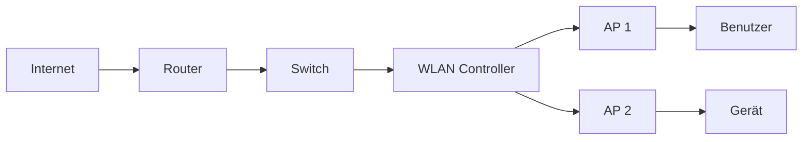

# WLAN (Wireless Local Area Network)

Zielgruppe: IT‑Auszubildende, Fachinformatiker Systemintegration, Einsteiger‑Administratoren

## Einführung
WLAN (Wi‑Fi) ermöglicht kabellosen Zugang zu Netzwerken über Funk. Diese Seite erklärt die technischen Grundlagen, Architektur und praktische Betriebsaspekte.

## Technische Definition
WLAN ist ein Erweiterungskonzept für LANs, das die IEEE 802.11‑Familie nutzt. Access Points verbinden Clients mit dem kabelgebundenen LAN und bieten SSIDs, Authentifizierung und Verschlüsselung.

## Detaillierte Erklärung
- Komponenten: Access Points (Standalone/Controller‑basiert), WLAN‑Controller, Clients, RADIUS‑Server, Managed Switches mit VLAN/Trunk.
- Standards: 802.11a/b/g/n/ac/ax (Wi‑Fi 4/5/6/6E) — beeinflussen Modulation, Kanalbreite, MIMO/OFDM.
- Frequenzen: 2.4 GHz (reichweitenstark), 5 GHz (mehr Kanäle), 6 GHz (Wi‑Fi 6E, neues Spektrum).

## Wie das WLAN funktioniert
- Client scannt Kanäle → verbindet mit SSID → Authentifizierung (PSK oder Enterprise via 802.1X/RADIUS) → DHCP‑Leasing → Datenverkehr über AP ins LAN.
- Roaming: 802.11r/k/v unterstützen schnellere Übergaben zwischen APs; Controller koordinieren Kanal‑ und Leistungsmanagement.

## OSI‑Layer Relevanz
- Layer 1: Funk (PHY)
- Layer 2: 802.11 MAC (Frames, Beacon, Association/Authentication)
- Layer 3: IP‑Routing am Gateway/Router

## Vorteile
- Mobilität und einfache Skalierbarkeit
- Schnelle Bereitstellung ohne Verkabelung

## Nachteile
- Anfällig für Interferenzen, Shared Medium reduziert effektive Bandbreite
- Planungsbedarf: AP‑Dichte, Kanalplanung

## Sicherheitsüberlegungen
- WPA3‑Enterprise (EAP‑TLS) empfehlen
- Gast‑Netze in separaten VLANs mit Internet‑only Firewalls
- WIDS/WIPS und kontinuierliche Funküberwachung

## Typische Einsatzfälle
- Büro‑WLAN mit zentralem Controller und RADIUS
- Hotspots mit Captive Portal für Gäste
- IoT‑Netzwerke mit speziellen SSIDs/VLANs

## Real‑World Beispiele
- Campus‑WLAN mit hundert+ APs und zentralem Management
- Einzelhändler mit POS über privates WLAN und Gäste‑SSID

## Häufige Fehler
- Unzureichende AP‑Dichte → Funklöcher
- Kanalüberfüllung im 2.4 GHz Band
- Keine Authentifizierungsisolation zwischen SSIDs

## Troubleshooting‑Hinweise
- Tools: Wireshark, Ekahau, NetSpot, AirMagnet
- Prüfen: RSSI, SNR, Retransmissions, Auth‑Logs, DHCP‑Leases

## Beispiel Konfiguration (802.1X, RADIUS)
```text
ssid "Betrieb"
  encryption wpa2/wpa3
  auth 802.1X
  radius-server 10.0.0.5 secret secret123
```

## Mermaid‑Diagramm


## Zusammenfassung
WLAN ist flexibel und leistungsfähig, benötigt aber durchdachtes Design (Funkplanung, Sicherheit, VLAN‑Design) für zuverlässigen Betrieb.

## Verwandte Themen
- [WLAN Frequenzen & Standards](../wlan/wifi-standards.md)
- [Hotspot / Access Point](../netzwerkgeraete/hotspot.md)
- [RADIUS](../netzwerkdienste/radius.md)
