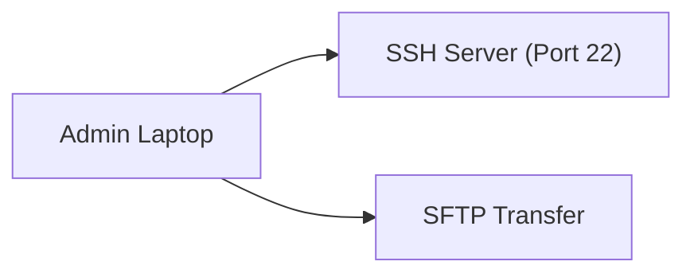

# SSH (Secure Shell)

## Einführung
SSH ist das Standardprotokoll für sicheren Fernzugriff auf Systeme, Dateiübertragungen (SCP/SFTP) und Port‑Tunneling. Es ersetzt unsichere Protokolle wie Telnet.

## Technische Definition
SSH ist ein kryptografisches Netzwerkprotokoll (typisch TCP/22) zur sicheren Authentifizierung, Verschlüsselung und Integrität für Remote‑Shells und Dateiübertragungen.

## Detaillierte Erklärung
- Komponenten: SSH‑Client, SSH‑Server (daemon), Schlüsselpaare (RSA, ECDSA, Ed25519)
- Authentifizierung: Passwortbasiert oder Public‑Key (empfohlen)
- Protokollversionen: SSH‑2 (heute Standard), SSH‑1 veraltet

## Wie es funktioniert
- TCP Verbindung zu Port 22 → Key‑Exchange (Diffie‑Hellman/Curve25519) → Verschlüsselung und Authentifizierung → verschlüsselte Session
- Port‑Forwarding (Local/Remote/Dynamic) ermöglicht Tunneling von Ressourcen

## OSI‑Layer Relevanz
- Layer 4 (TCP) und Layer 7 (Application)

## Vorteile
- Starke Verschlüsselung und Authentifizierung
- Unterstützt Dateiübertragung (SCP/SFTP) und Tunneling

## Nachteile
- Bei falscher Konfiguration (z. B. Passwort‑Auth) Angriffsfläche für Brute‑Force

## Sicherheitsüberlegungen
- Public‑Key Authentifizierung (Ed25519/RSA 4096)
- Deaktivieren von Root‑Login, starke Passwörter, Fail2Ban/Port‑Knock
- Verwenden von SSH‑Agent und Schlüsselpassphrase

## Typische Einsatzfälle
- Remote‑Administration, automatisierte Skripts mit Keys, Git über SSH, SFTP für Dateitransfer

## Real‑World Beispiele
- Administrator verbindet per `ssh admin@host` und verwendet `scp` für Konfig‑Backups

## Häufige Fehler
- Offenlassen von Passwort‑Auth in Produktivumgebungen
- Ungepatchte SSH‑Server (CVE‑Risiken)
- Schlüsselverwaltung (Schlüssel nicht widerrufen)

## Troubleshooting‑Hinweise
- Debugging: `ssh -vvv user@host` prüfen
- Verbindungsfehler: Port, Firewall, HostKey‑Fingerabdruck prüfen
- Auth‑Probleme: `authorized_keys` Berechtigungen (600/700) prüfen

## Beispiel (Key‑Generierung)
```bash
# Ed25519 Key erstellen
ssh-keygen -t ed25519 -C "admin@company"
# Key auf Server kopieren
ssh-copy-id -i ~/.ssh/id_ed25519.pub user@host
```

## Mermaid‑Diagramm


## Zusammenfassung
SSH ist das zentrale Werkzeug für sichere Administration. Public‑Key‑Auth, harte Sicherheitsrichtlinien und Monitoring halten SSH‑Zugänge sicher.

## Verwandte Themen
- [VPN](vpn.md)
- [Firewall](../netzwerkgeraete/firewall.md)
- [AES](aes.md)
