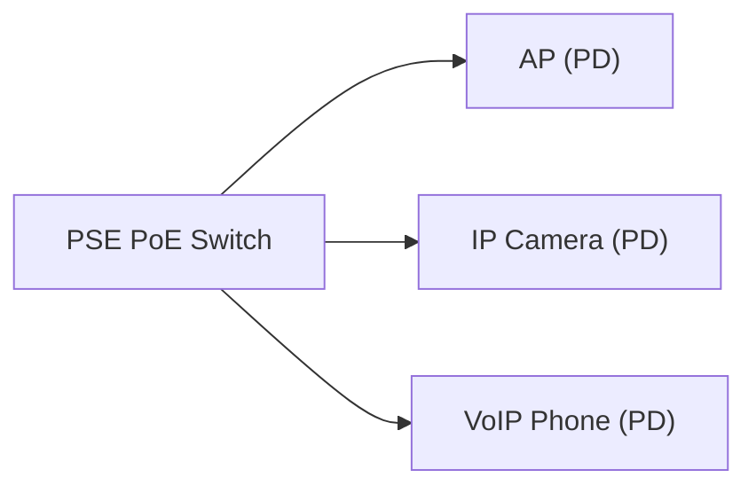

# PoE (Power over Ethernet)

Zielgruppe: IT‑Auszubildende, Fachinformatiker Systemintegration, Einsteiger‑Administratoren

## Einführung
PoE erlaubt die Versorgung von Netzwerkgeräten (z. B. Access Points, IP‑Kameras) über das Ethernet‑Kabel, ohne separate Stromzufuhr.

## Technische Definition
PoE ist in IEEE‑Standards definiert: 802.3af (PoE), 802.3at (PoE+), 802.3bt (PoE++ / 4PPoE) mit steigender Leistungsfähigkeit.

## Detaillierte Erklärung
- Leistungsstufen: 802.3af bis 15,4W, 802.3at bis 30W, 802.3bt Typ3/4 bis 60–100W
- Versorgung: Power Sourcing Equipment (PSE) (Switch oder Injector) und Powered Device (PD)
- Detection & Classification: PSE erkennt PD vor dem Liefern von Strom

## Wie es funktioniert
- PSE liefert DC‑Spannung über bestimmte Adernpaare; PD signalisiert Bedarf durch Resistive Signature
- Schutzmechanismen verhindern Beschädigung nicht‑PoE Geräte

## OSI‑Layer Relevanz
- Layer 1 (Physical) — Strom über das Kabel parallel zu Daten

## Vorteile
- Keine separate Stromversorgung/Steckdose erforderlich
- Reduziert Installationsaufwand für APs, Kameras, VoIP‑Telefone

## Nachteile
- Leistungsverluste über längere Kabel
- Begrenzte Leistung pro Port (je nach Standard)

## Sicherheitsüberlegungen
- Verwenden von IEEE‑konformen PSE/PD, Überspannungsschutz
- Physischer Zugriff auf PSE kontrollieren

## Typische Einsatzfälle
- WLAN‑Access Points, IP‑Telefonie, IP‑Kameras, kleine IoT‑Geräte

## Real‑World Beispiele
- PoE‑Switch versorgt mehrere Access Points in Bürogebäuden

## Häufige Fehler
- Nicht‑PoE‑Geräte an PoE‑Ports: normalerweise geschützt, aber inkompatible Hardware vermeiden
- Kabellängen >100m führen zu Spannungsabfall und Leistungsprobleme

## Troubleshooting‑Hinweise
- PSE/PD LEDs prüfen, Power Budget am Switch kontrollieren
- Kabelqualität (Kategorie) prüfen, Länge messen
- PD‑Class prüfen und PSE‑Konfiguration

## Beispiel (PoE Budget)
```text
Switch PoE Budget: 370W
AP benötigt: 20W => max 18 APs gleichzeitig
```

## Mermaid‑Diagramm


## Zusammenfassung
PoE vereinfacht Installation und Betrieb zahlreicher Netzwerkgeräte. Planung des Power Budgets, passende Kabelkategorien und Einhaltung von Standards sind entscheidend.

## Verwandte Themen
- [Verkabelung / Cat‑Kabel](../verkabelung/cat-kabel.md)
- [Access Point / Hotspot](../netzwerkgeraete/hotspot.md)

