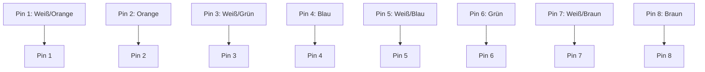

# EIA/TIA-568 Standard

## Einführung
Der EIA/TIA-568 ist ein Verkabelungsstandard für strukturierte Gebäudeverkabelung in Netzwerken.

## Technische Definition
EIA/TIA-568 spezifiziert die Pinbelegung, Farbzuordnung und Installation von Twisted-Pair-Kabeln (z. B. Cat5e, Cat6) für Netzwerke.

## Detaillierte Erklärung
Es gibt zwei Hauptvarianten: T568A und T568B. Beide definieren die Zuordnung der acht Adern auf die acht Pins eines RJ45-Steckers.

| Pin | T568A Farbe | T568B Farbe |
|-----:|-------------|-------------|
| 1   | Weiß/Grün   | Weiß/Orange |
| 2   | Grün        | Orange      |
| 3   | Weiß/Orange | Weiß/Grün   |
| 4   | Blau        | Blau        |
| 5   | Weiß/Blau   | Weiß/Blau   |
| 6   | Orange      | Grün        |
| 7   | Weiß/Braun  | Weiß/Braun  |
| 8   | Braun       | Braun       |

## Funktionsweise
Die Norm stellt sicher, dass Kabel und Anschlüsse herstellerübergreifend kompatibel sind und eine fehlerfreie Datenübertragung ermöglichen.

## OSI-Schicht-Zuordnung
Layer 1 (Bitübertragungsschicht).

## Vorteile
- Einheitliche Verkabelung
- Fehlervermeidung durch Standardisierung
- Kompatibilität

## Nachteile
- Falsche Anwendung führt zu Verbindungsproblemen
- Verwechslung von T568A und T568B möglich

## Sicherheitsaspekte
- Korrekte Pinbelegung verhindert Kurzschlüsse und Datenverlust

## Typische Anwendungsfälle
- Installation von Netzwerkdosen und Patchfeldern
- Herstellung von Patchkabeln

## Praxisbeispiele
- Patchpanel nach T568B belegt, Arbeitsplatzdose nach T568B

## Häufige Fehler
- Mischen von T568A und T568B an einem Kabel (Crossover statt Patchkabel)
- Falsche Farbreihenfolge

## Troubleshooting-Tipps
- Pinbelegung mit Durchgangsprüfer kontrollieren
- Farbcode-Tabelle verwenden

## Zusammenfassung
EIA/TIA-568 ist essenziell für die strukturierte Verkabelung und die Kompatibilität von Netzwerkinstallationen.

## Verwandte Themen
- [CatKabel](cat-kabel.md)
- [Rj45](rj45.md)
- [Patchkabel](patchkabel.md)

## Beispiel: T568B Belegung (Mermaid-Diagramm)

