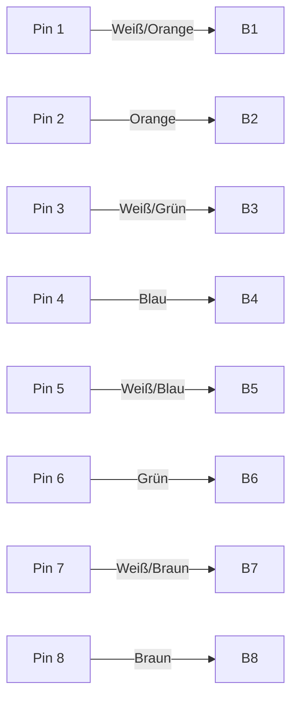

# RJ45-Stecker

## Einführung
Der RJ45-Stecker ist der Standardanschluss für Ethernet-Netzwerke.

## Technische Definition
RJ45 ist ein 8-poliger Modularstecker (8P8C), der für Twisted-Pair-Kabel (z. B. Cat5e, Cat6) verwendet wird.

## Detaillierte Erklärung
Der Stecker besteht aus acht Kontakten, die mit den Adern des Netzwerkkabels verbunden werden. Er wird für Netzwerkdosen, Patchkabel und Patchfelder genutzt.

## Funktionsweise
Die Kontakte werden mit den Adern nach EIA/TIA-568A oder 568B belegt. Ein Rastmechanismus sorgt für sicheren Halt in der Buchse.

## OSI-Schicht-Zuordnung
Layer 1 (Bitübertragungsschicht).

## Vorteile
- Weit verbreitet und standardisiert
- Einfache Montage
- Kompatibel mit vielen Geräten

## Nachteile
- Mechanisch empfindlich (Rastnase kann abbrechen)
- Unsachgemäße Montage führt zu Kontaktproblemen

## Sicherheitsaspekte
- Rastnase schützt vor unbeabsichtigtem Herausziehen
- Manipulation am Stecker kann zu Netzwerkausfällen führen

## Typische Anwendungsfälle
- Anschluss von PCs, Switches, Routern
- Patchkabel und Wanddosen

## Praxisbeispiele
- Verbindung eines PCs mit einem Switch über ein Patchkabel mit RJ45-Steckern

## Häufige Fehler
- Falsche Pinbelegung
- Unvollständiges Einrasten des Steckers
- Adern nicht bis zum Kontakt geführt

## Troubleshooting-Tipps
- Stecker auf korrekten Sitz prüfen
- Durchgangsprüfer verwenden
- Sichtkontrolle der Kontakte

## Zusammenfassung
Der RJ45-Stecker ist das Bindeglied zwischen Netzwerkkabel und Gerät. Sorgfältige Montage ist entscheidend für eine stabile Verbindung.

## Verwandte Themen
- [CatKabel](cat-kabel.md)
- [Eia568](eia568.md)
- [Patchkabel](patchkabel.md)

## Beispiel: RJ45-Pinbelegung (Mermaid-Diagramm)

