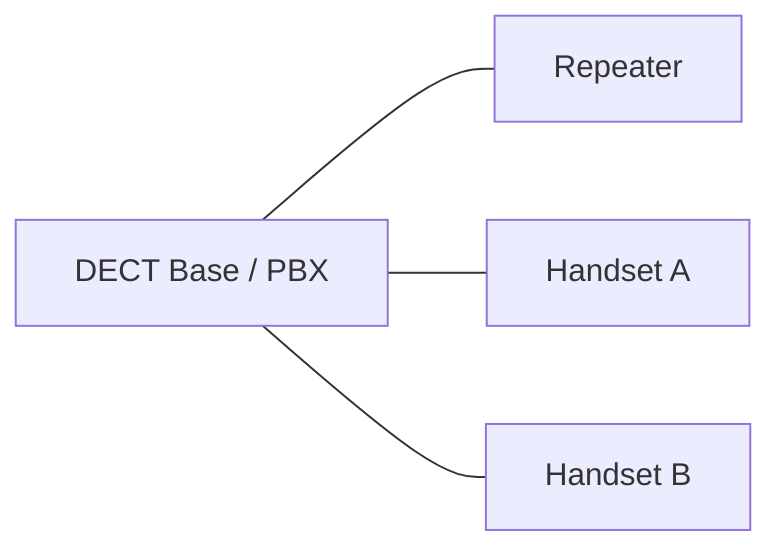

# DECT (Digital Enhanced Cordless Telecommunications)

## Einführung
DECT ist ein Funkstandard primär für schnurlose Telefonie und in jüngerer Zeit für IoT‑Anwendungen (DECT ULE). Diese Seite beschreibt Technik, Einsatz und Betriebsaspekte.

## Technische Definition
DECT ist ein digitaler Funkstandard im 1,88–1,90 GHz Bereich (Region abhängig) für Sprach‑ und Datendienste zwischen Basisstation (BTS) und Mobilteilen.

## Detaillierte Erklärung
- Komponenten: Basisstation (PBX/DECT‑Server), Mobilteil (Handset), Repeater
- Kanäle: FDMA/TDMA basiertes Mehrfachzugriffsverfahren mit 10 Time‑Slots
- DECT ULE: Low‑Energy Profil für IoT‑Sensorik

## Wie DECT funktioniert
- Basisstation koordiniert Verbindungen; Handset registriert sich und nutzt zugewiesene Timeslots für Sprache/Daten.
- Handover unterstützt nahtlose Übergabe zwischen Basisstationen (Enterprise‑DECT)

## OSI‑Layer Relevanz
- Layer 1: PHY (1.9 GHz), Modulation und Timeslot‑Aufteilung
- Layer 2: Link‑Layer‑Protokolle für Sicherung und Handover

## Vorteile
- Gute Sprachqualität, geringe Latenz
- Separates Frequenzband (mindernde Interferenz mit Wi‑Fi)
- DECT ULE für batteriefreundliche IoT‑Anwendungen

## Nachteile
- Begrenzte Reichweite pro Basisstation
- Spezifische Hardware erforderlich
- Regulierung/Anmeldepflicht in einigen Ländern

## Sicherheitsüberlegungen
- DECT Verschlüsselung (DECT Standard Cipher) verwenden
- Standard‑Default‑PINs ändern, Basisstation absichern
- ULE: Verschlüsselung und Authentifizierung auch für IoT sicherstellen

## Typische Einsatzfälle
- Schnurlose Telefone in Büros/Privathaushalten
- Enterprise‑DECT für Fabrik/Hospital Kommunikation
- DECT ULE für Smart‑Home/IoT Sensoren

## Real‑World Beispiele
- Büro: PBX mit DECT Basis für Mitarbeiter‑Telefonie
- Smart Building: DECT ULE Sensoren für Funk‑Alarmmeldung

## Häufige Fehler
- Übersehen von Interferenzquellen / Reichweitenprobleme
- Unzureichende Redundanz bei kritischer Sprachkommunikation

## Troubleshooting‑Hinweise
- Repeater/Mehrere Basen für Coverage prüfen
- Signalstärke und Handset‑Logs analysieren
- Firmware und Registrierungsstatus prüfen

## Mermaid‑Diagramm

## Zusammenfassung
DECT ist ein stabiler Standard für schnurlose Sprach‑ und Low‑Energy‑IoT‑Anwendungen. Für Unternehmen ist DECT oft zuverlässiger für Sprachdienste als Wi‑Fi‑basierte Lösungen, benötigt jedoch dedizierte Hardware und Planung.

## Verwandte Themen
- [WLAN Frequenzen](wlan-frequenzen.md)
- [Hotspot / Access Point](../netzwerkgeraete/hotspot.md)
