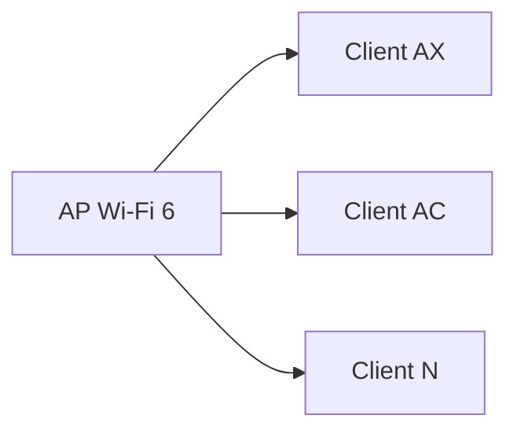

# Wi‑Fi / IEEE 802.11‑Standards

## Einführung
Übersicht über die wichtigsten IEEE 802.11 (Wi‑Fi) Standards: b/g/n/ac/ax (Wi‑Fi 4/5/6) und ihre technischen Merkmale, Anwendungsfälle und Kompatibilitäten.

## Technische Definition
IEEE 802.11 ist eine Familie von Standards für drahtlose lokale Netzwerke. Jeder Standard definiert Modulationsverfahren, Kanalbreiten, MIMO‑Fähigkeiten und maximale theoretische Datenraten.

## Detaillierte Erklärung
- 802.11b (2,4 GHz, DSSS): bis 11 Mbps (älter)
- 802.11a (5 GHz, OFDM): bis 54 Mbps
- 802.11g (2,4 GHz, OFDM): bis 54 Mbps, kompatibel zu b
- 802.11n (Wi‑Fi 4): MIMO, 20/40 MHz, bis zu 600 Mbps
- 802.11ac (Wi‑Fi 5): OFDM, MU‑MIMO (downlink), 80/160 MHz, bis mehrere Gbps
- 802.11ax (Wi‑Fi 6): OFDMA, MU‑MIMO (uplink+downlink), bessere Effizienz in dichtem Umfeld
- 802.11be (Wi‑Fi 7, Roadmap): höhere Kanalbreiten, Multi‑Link Operation

## Wie die Technologie funktioniert
- Modulation/Multiplex: OFDM, MIMO, MU‑MIMO und OFDMA (bei Wi‑Fi 6) erhöhen Spektrumeffizienz.
- Kanalbreiten: breitere Kanäle ermöglichen höhere Datenraten, erhöhen aber Interferenzrisiko.

## OSI‑Layer Relevanz
- Layer 1: PHY‑Spezifikationen (Modulation, Kanal)
- Layer 2: MAC (Contention, Beaconing, Association)

## Vorteile
- Neuere Standards bieten bessere Spektrumeffizienz, geringere Latenz und höhere Datendurchsätze
- Abwärtskompatibilität erleichtert Migration

## Nachteile
- Legacy‑Geräte können Netzwerkleistung beeinträchtigen
- Höhere Standards benötigen kompatible Client‑Hardware

## Sicherheitsüberlegungen
- WPA3 empfohlen; WPA2 als Mindeststandard
- Management Frames schützen (802.11w für Management Frame Protection)

## Typische Einsatzfälle
- 802.11n/ac/ax: Unternehmens‑WLAN, Hotspots, Medien‑Streaming
- Frühere Standards nur in Legacy‑Umgebungen

## Real‑World Beispiele
- Campus mit Wi‑Fi 6 Access Points und Client‑Roaming
- Veranstaltungsorte nutzen AC/AX für hohe Dichte

## Häufige Fehler
- Mixed‑Mode Betrieb (Legacy + Modern) ohne passende QoS‑Einstellungen
- Unnötig breite Kanalwahl in überfüllten Umgebungen

## Troubleshooting‑Hinweise
- Geräte‐Logs prüfen (Client & AP)
- Performance messen: Throughput, Retransmissions, Latency
- Firmware‑Updates prüfen (Treiber und AP)

## Vergleichstabelle (Kurz)
| Standard | Band | Max. Kanal | Merkmale |
|---|---:|---:|---|
| 802.11b | 2.4 GHz | 20 MHz | DSSS, alt, langsam |
| 802.11a | 5 GHz | 20 MHz | OFDM |
| 802.11g | 2.4 GHz | 20 MHz | OFDM, kompatibel zu b |
| 802.11n (Wi‑Fi 4) | 2.4/5 GHz | 40 MHz | MIMO, HT |
| 802.11ac (Wi‑Fi 5) | 5 GHz | 160 MHz | MU‑MIMO (DL), VHT |
| 802.11ax (Wi‑Fi 6) | 2.4/5/6 GHz | 160 MHz | OFDMA, MU‑MIMO, effizienter |

## Mermaid‑Diagramm

## Zusammenfassung
Die Wahl des Wi‑Fi‑Standards beeinflusst Performance und Effizienz. Wi‑Fi 6/6E bieten signifikante Verbesserungen in dicht belegten Umgebungen; Migration sollte geplant und getestet werden.

## Verwandte Themen
- [WLAN Frequenzen](wlan-frequenzen.md)
- [Access Point / Hotspot](../netzwerkgeraete/hotspot.md)
