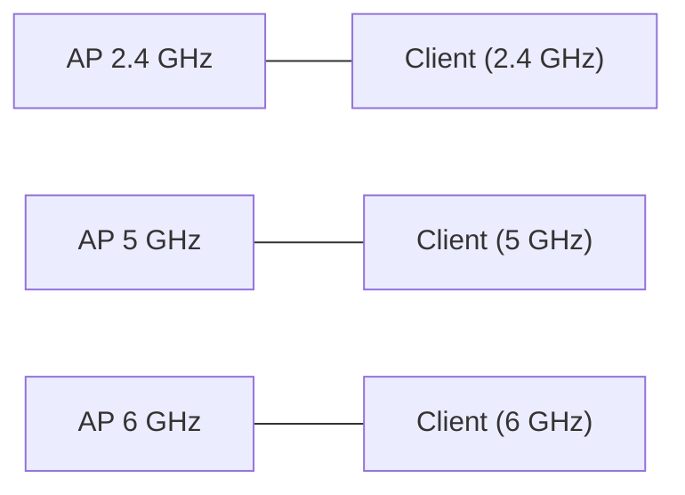

# WLAN‑Frequenzen

## Einführung
Diese Seite erklärt die für WLAN genutzten Frequenzbänder (2,4 GHz, 5 GHz, 6 GHz), deren Eigenschaften, Kanalschemata und praktische Auswirkungen auf Planung und Betrieb.

## Technische Definition
WLAN‑Frequenzen sind Funkbänder innerhalb des Funkspektrums, die für IEEE 802.11‑Standards freigegeben sind. Unterschiedliche Bänder bieten verschiedene Kanalanzahlen, Bandbreiten und Ausbreitungseigenschaften.

## Detaillierte Erklärung
- 2,4 GHz:
  - Breite Abdeckung, bessere Durchdringung von Wänden
  - Nur 3 nicht überlappende 20 MHz‑Kanäle (in Europa: 1,5,9,13 variieren)
  - Stark frequentiert (Bluetooth, Mikrowellen)
- 5 GHz:
  - Mehr Kanäle, höhere Kanalbreiten (20/40/80/160 MHz)
  - Bessere Gesamtdurchsatz, geringere Reichweite als 2,4 GHz
  - DFS (Dynamic Frequency Selection) und TPC (Transmit Power Control) in einigen Kanälen
- 6 GHz (Wi‑Fi 6E):
  - Großes neues Spektrum, viele Kanäle (20/40/80/160 MHz)
  - Niedrigere Interferenz, hohe Leistung, regulatorische Einschränkungen je Land

## Wie die Technologie arbeitet
- Ein AP sendet auf einem bestimmten Kanal im gewählten Band; Clients und AP müssen denselben Kanal/SSID verwenden.
- Kanalbreite beeinflusst Datendurchsatz (breitere Kanäle → mehr Durchsatz, aber höhere Interferenz‑Anfälligkeit).
- DFS‑Kanäle können kurzzeitig gesperrt werden, wenn Radar erkannt wird.

## OSI‑Layer Relevanz
- Layer 1 (Physical): Frequenz, Modulation, Kanalbandbreite
- Layer 2 (Data Link): 802.11 MAC überträgt Frames auf den PHY

## Vorteile
- 2,4 GHz: Reichweite und Penetration
- 5 GHz/6 GHz: Höherer Durchsatz, mehr Kanäle, weniger Überlappungen

## Nachteile
- 2,4 GHz: Überlastet, wenige Kanäle
- 5 GHz: Geringere Reichweite, DFS‑Unterbrechungen möglich
- 6 GHz: Nicht alle Geräte unterstützen 6 GHz; Länderabhängige Regulierung

## Sicherheitsüberlegungen
- Frequenzwahl beeinflusst Angriffsflächen (z. B. Rogue APs in dicht belegten Bändern)
- Kanalwechsel (DFS) kann zu kurzfristigen Downtimes führen; Monitoring wichtig

## Typische Einsatzfälle
- 2,4 GHz: IoT, einfache Sensorik, große Flächen mit wenigen APs
- 5 GHz: Unternehmens‑WLAN, VoIP, Multimedia
- 6 GHz: High‑density, hohe Bandbreiten‑Anwendungen (AR/VR, Bulk‑Transfers)

## Real‑World Beispiele
- Büro: APs primär im 5 GHz betreiben, 2,4 GHz nur für Legacy/IoT Geräte
- Öffentliche Hotspots: Kanalplanung zur Vermeidung von Kollisionen

## Häufige Fehler
- Alle APs auf Standardkanal 6 im 2,4 GHz Betrieb
- Zu viele breite Kanäle (80/160 MHz) in dichtem Umfeld
- DFS‑Kanäle ohne Monitoring einsetzen

## Troubleshooting‑Hinweise
- Kanalbelegung scannen (z. B. mit Wi‑Fi Analyzer)
- RSSI/SNR messen, Retransmissions prüfen
- Bei DFS‑Auslösung Logs prüfen und ggf. AP‑Firmware aktualisieren

## Beispiel (Kanal‑Übersicht)
```text
2.4 GHz: Kanäle 1..13 (europa), 3 non‑overlap at 20 MHz: 1,6,11
5 GHz: mehrere UNII‑Bereiche, nutzen 20/40/80/160 MHz
6 GHz: große Anzahl neuer 20 MHz Kanäle (Region abhängig)
```

## Mermaid‑Diagramm


## Zusammenfassung
Die Wahl des Frequenzbands ist ein zentraler Teil der WLAN‑Planung. 2,4 GHz bietet Reichweite, 5 GHz und 6 GHz bieten mehr Kanäle und höheren Durchsatz — richtige Kanalplanung und Monitoring sind entscheidend.

## Verwandte Themen
- [WLAN Standards](wifi-standards.md)
- [Access Point / Hotspot](../netzwerkgeraete/hotspot.md)
- [Mesh](../netzwerktypen/mesh.md)
